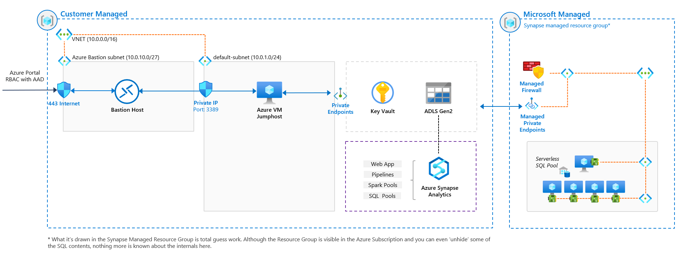

# Azure Synapse Terraform Example

This repo shows an example for rolling out a complete [Azure Synapse Analytics](https://azure.microsoft.com/services/synapse-analytics/) enterprise environment via Terraform. This version uses [Azure Terraform modules](https://github.com/murggu/azure-terraform-modules/); check the old version at [azure-synapse-terraform-nomodules](https://github.com/murggu/azure-synapse-terraform/tree/nomodules).



This includes rollout of the following resources:

- Azure Synapse Analytics Workspace with Private Endpoints
- Azure Synapse Analytics Private Link Hub with Private Endpoint 
- Azure Storage Account with Private Endpoints for `blob` and `dfs`
- Azure Key Vault with Private Endpoint 
- Virtual Network
- Jumphost (Windows) with Bastion for easy access to the VNet

## Instructions

Make sure you have the [Azure CLI](https://docs.microsoft.com/cli/azure/install-azure-cli) and [Terraform](https://www.terraform.io/downloads.html) installed. 

1. Copy `terraform.tfvars.example` to `terraform.tfvars`
2. Update `terraform.tfvars` with your desired values
3. Run Terraform
    ```console
    $ terraform init
    $ terraform plan
    $ terraform apply
    ```
    
## Notes
See notes below for additional info:

- A public IP is added to Azure Storage Account and Azure Synapse Analytics firewall rules to enable the deployment. That rule could be removed once the deployment is finished, only limiting jumphost access.
- Change `enable_syn_sqlpool` and `enable_syn_sparkpool` values if you wanna deploy any of those pools.
- The deployment was tested on wsl (ubuntu).
